# Tools Management Guide - LLM Agent Tool Integration

## Overview

This guide covers how LLM agents discover, select, and execute tools. Understanding this is crucial for building production-grade AI agents and for technical interviews about agent architectures.

---

## Table of Contents

1. [How LLMs Learn About Tools](#how-llms-learn-about-tools)
2. [Tool Interaction Flow](#tool-interaction-flow)
3. [The Two LLM Calls Pattern](#the-two-llm-calls-pattern)
4. [Challenges for LLMs Using Tools](#challenges-for-llms-using-tools)
5. [Tool Definitions](#tool-definitions)
6. [Available Tools](#available-tools)
7. [Production Integration](#production-integration)
8. [Interview Talking Points](#interview-talking-points)

---

## How LLMs Learn About Tools

LLMs discover and select tools through **three key mechanisms**:

### 1. Tool Schemas (Function Declarations)

Tools are defined using structured schemas that describe:
- **Name**: Tool identifier (e.g., `"calculator"`)
- **Description**: What the tool does and when to use it (CRITICAL for tool selection)
- **Parameters**: Input arguments with types and descriptions
- **Required fields**: Which parameters are mandatory

**Example Tool Schema:**
```python
{
    "name": "web_search",
    "description": "Search the web for information on any topic. Use this when you need current information, facts, or data from the internet.",
    "parameters": {
        "type": "object",
        "properties": {
            "query": {
                "type": "string",
                "description": "The search query or question to search for on the web"
            },
            "num_results": {
                "type": "integer",
                "description": "Number of search results to return (default: 5, max: 10)"
            }
        },
        "required": ["query"]
    }
}
```

### 2. System Instructions

System prompts guide the LLM on when to use each tool:

```python
system_instruction = """You are a helpful personal assistant with access to various tools.

When a user asks for:
- Math calculations → use calculator tool
- Current information, facts, or web data → use web_search tool
- Weather updates → use get_weather tool
- Date/time information → use get_current_time tool
- Saving information or reminders → use create_note tool
- Retrieving saved information → use get_note tool

Always explain what you're doing and provide helpful, clear responses."""
```

### 3. Model Training

LLMs are pre-trained on function calling patterns, enabling them to:
- Recognize when a tool is needed
- Extract relevant parameters from natural language
- Generate structured function call objects
- Format tool results into natural responses

---

## Tool Interaction Flow

Here's the complete interaction between User, System, LLM, and Tools:

```mermaid
sequenceDiagram
    participant User
    participant System as System/Code
    participant LLM as LLM (Gemini)
    participant Tool as Tool Function
    
    Note over User,Tool: Example: User asks "What's 25 * 4?"
    
    %% Step 1: User input
    User->>System: "What's 25 * 4?"
    
    %% Step 2: First LLM call
    System->>System: Build conversation history
    Note over System: history = [<br/>  {"role": "user", "parts": ["What's 25 * 4?"]}<br/>]
    
    System->>LLM: 🔴 LLM CALL #1: generate_content(history)
    Note over LLM: Model has tool schemas in context<br/>Analyzes query: "This needs calculator"
    
    LLM->>LLM: Decides to use calculator tool
    Note over LLM: Generates function_call object:<br/>{<br/>  "name": "calculator",<br/>  "args": {"expression": "25 * 4"}<br/>}
    
    LLM-->>System: ✅ Response with function_call
    
    %% Step 3: Tool detection and execution
    System->>System: Detect function_call in response
    Note over System: Found: function_call.name = "calculator"<br/>Args: {"expression": "25 * 4"}
    
    System->>System: Add function_call to history
    Note over System: history.append(<br/>  {"role": "model",<br/>   "parts": [{"function_call": ...}]}<br/>)
    
    System->>Tool: execute_tool("calculator", {"expression": "25 * 4"})
    Note over Tool: Executes: eval("25 * 4")
    Tool-->>System: ✅ Returns "100"
    
    System->>User: 🔧 [Shows to user: Tool execution details]
    
    %% Step 4: Add function response to history
    System->>System: Add function_response to history
    Note over System: history.append(<br/>  {"role": "function",<br/>   "parts": [{<br/>     "function_response": {<br/>       "name": "calculator",<br/>       "response": {"result": "100"}<br/>     }<br/>   }]}<br/>)
    
    %% Step 5: Second LLM call
    System->>LLM: 🔴 LLM CALL #2: generate_content(history)
    Note over System,LLM: Now history includes:<br/>1. User query<br/>2. Function call<br/>3. Function response
    
    Note over LLM: Model sees tool result: "100"<br/>Generates natural language response
    
    LLM-->>System: ✅ Response with text: "The result is 100"
    
    %% Step 6: Return to user
    System->>System: Extract text from response
    System->>User: "The result is 100"
    
    Note over User,Tool: ✅ Complete! User got answer via 2 LLM calls + 1 tool execution
```



---

## The Two LLM Calls Pattern

When a tool is used, **TWO separate LLM calls** are made:

### LLM Call #1: Decision & Tool Selection

**Purpose:** Determine which tool to call and extract parameters

**Input:**
```python
conversation_history = [
    {"role": "user", "parts": ["What's 25 * 4?"]}
]
```

**Output:**
```python
response.candidates[0].content.parts = [
    function_call {
        name: "calculator"
        args: {"expression": "25 * 4"}
    }
]
```

**Code Location:**
```python
# tool_agent.py line 432
response = agent.generate_content(conversation_history)  # ← LLM CALL #1

# Detect function call
for part in response.candidates[0].content.parts:
    if hasattr(part, 'function_call') and part.function_call:
        function_call = part.function_call
```

---

### Tool Execution (Between LLM Calls)

**No LLM involved** - Pure Python execution

```python
# tool_agent.py line 470
tool_result = execute_tool(function_name, args)
# Returns: "100"
```

**History Update:**
```python
# Add function call
conversation_history.append({
    "role": "model",
    "parts": [{"function_call": function_call}]
})

# Add function response
conversation_history.append({
    "role": "function",
    "parts": [{
        "function_response": {
            "name": "calculator",
            "response": {"result": "100"}
        }
    }]
})
```

---

### LLM Call #2: Response Synthesis

**Purpose:** Format tool results into natural language

**Input:**
```python
conversation_history = [
    {"role": "user", "parts": ["What's 25 * 4?"]},
    {"role": "model", "parts": [{"function_call": {...}}]},
    {"role": "function", "parts": [{"function_response": {...}}]}
]
```

**Output:**
```python
response.text = "The result is 100"
```

**Code Location:**
```python
# tool_agent.py line 495
final_response = agent.generate_content(conversation_history)  # ← LLM CALL #2
response_text = final_response.text
```

---

## Why Two LLM Calls?

### Architectural Reasons:

| Aspect | Explanation |
|--------|-------------|
| **Separation of Concerns** | Call #1: Decision-making (which tool, what args)<br/>Call #2: Response synthesis (format results naturally) |
| **LLM Can't Execute** | LLM can only generate instructions<br/>System must execute actual tools<br/>LLM then interprets results |
| **Flexible Formatting** | Tool might return complex data<br/>LLM can format/explain/summarize<br/>LLM can combine multiple tool results |
| **Error Handling** | If tool fails, LLM can handle gracefully<br/>LLM can suggest alternatives |

### Cost Implications:

```
Single Query with Tool Usage:
├── LLM Call #1: 
│   ├── Input: 50 tokens (conversation history)
│   └── Output: 20 tokens (function_call)
├── Tool Execution: 0 LLM tokens
└── LLM Call #2:
    ├── Input: 80 tokens (history + function_call + function_response)
    └── Output: 30 tokens (final response)
    
Total: ~180 tokens (vs ~80 tokens without tools)
Token cost approximately DOUBLES with tool usage
```

---

## Challenges for LLMs Using Tools

Understanding the challenges LLMs face when using tools is crucial for building robust agent systems and for technical interviews. Here are the **biggest challenges** and how to address them.

---

### 1. Tool Selection & Decision Making ⭐ Most Common Challenge

**The Problem:**
- Choosing the right tool from multiple options
- Understanding WHEN to use a tool vs. using internal knowledge
- Handling ambiguous queries that could match multiple tools

#### Examples of Tool Selection Failures

**Scenario 1: Ambiguous Query**
```python
User: "What's the temperature?"

# LLM Confusion - Multiple possible interpretations:
Option A: get_weather(location="?")  # Weather temperature (needs location!)
Option B: calculator("?")             # If there's a temperature calculation in context
Option C: Answer from knowledge       # General info about temperature
Option D: get_current_time()          # Complete misunderstanding!

# What should happen:
# LLM should ask: "Do you mean the weather temperature? If so, which location?"
```

**Scenario 2: Knowledge vs. Tool Decision**
```python
# Case 1: Should NOT use tool
User: "Tell me about Python"
❌ LLM calls: web_search("Python")  # Unnecessary! Well-known topic
✅ LLM should: Answer directly from training

# Case 2: Should use tool  
User: "Tell me about Python 3.13 new features"
✅ LLM calls: web_search("Python 3.13 new features")  # Needs current info
❌ LLM answers: From training data (likely outdated)
```

**Scenario 3: Multiple Tool Confusion**
```python
User: "Find information about the weather in Tokyo"

# Similar tools might confuse LLM:
get_weather("Tokyo")      # ✅ Correct - real-time weather
web_search("Tokyo weather")  # ⚠️ Also works but less efficient
calculator()              # ❌ Wrong tool entirely
```

#### Solution Strategies

**1. Explicit Decision Rules in System Prompt**
```python
system_instruction = """
Tool Selection Rules:

1. Use web_search ONLY for:
   ✅ Current events (after training cutoff)
   ✅ Real-time data (stock prices, news, recent updates)
   ✅ Specific recent information (latest versions, new releases)
   
2. DO NOT use web_search for:
   ❌ Well-known concepts (Python basics, math formulas)
   ❌ General knowledge (historical facts, established science)
   ❌ Questions you can answer confidently from training
   
3. Use get_weather for:
   ✅ Current weather conditions
   ✅ Weather forecasts
   
4. Use calculator for:
   ✅ Mathematical expressions
   ✅ Numerical computations
   
5. When in doubt:
   - Answer directly if you're confident
   - Acknowledge uncertainty if unsure
   - Ask user for clarification on ambiguous requests
"""
```

**2. Tool Descriptions That Prevent Overlap**
```python
{
    "name": "web_search",
    "description": "Search the web for CURRENT information published after your training cutoff. Use ONLY when you need real-time data, recent events, or up-to-date facts. DO NOT use for general knowledge you already have.",
},
{
    "name": "get_weather", 
    "description": "Get CURRENT weather for a specific location. More efficient than web_search for weather queries. Requires exact location name.",
}
```

---

### 2. Parameter Extraction & Validation 🎯

**The Problem:**
- Extracting correct parameters from natural language
- Handling implicit or missing information
- Type mismatches (string vs. integer, format issues)
- Natural language ambiguity

#### Examples of Parameter Extraction Failures

**Scenario 1: Missing Required Parameters**
```python
User: "What's the weather?"

# Tool needs: get_weather(location=?)
# Problem: Location is required but not provided!

# Bad LLM behavior:
get_weather(location="")  # Empty string - will fail

# Good LLM behavior:
"I'd be happy to check the weather for you. Which city or location would you like to know about?"
```

**Scenario 2: Ambiguous References**
```python
User: "Search for that article we discussed earlier"

# Tool needs: web_search(query=?)
# Problem: "that article" is not specific enough!

# Bad LLM behavior:
web_search(query="that article")  # Useless search

# Good LLM behavior:
"Could you remind me which article you're referring to? I'd be happy to search for it."
```

**Scenario 3: Type Mismatches**
```python
User: "Get me five search results about Python"

# Tool expects: web_search(query="Python", num_results=5)

# Common mistakes:
web_search(query="five search results about Python", num_results="five")
# ❌ "five" is string, should be integer 5

web_search(query="Python", num_results="5")
# ⚠️ String "5" instead of integer 5 (might work with coercion)

# Correct:
web_search(query="Python", num_results=5)
# ✅ Proper types
```

**Scenario 4: Format Requirements**
```python
User: "What time is it in New York City?"

# Tool expects IANA timezone format

# Common mistakes:
get_current_time(timezone="New York City")  # ❌ Not IANA format
get_current_time(timezone="NYC")            # ❌ Abbreviation
get_current_time(timezone="EST")            # ❌ Timezone abbreviation

# Correct:
get_current_time(timezone="America/New_York")  # ✅ IANA format
```

#### Solution Strategies

**1. Detailed Parameter Descriptions**
```python
{
    "name": "get_current_time",
    "parameters": {
        "timezone": {
            "type": "string",
            "description": """
            Timezone name in IANA format (e.g., 'America/New_York', 'Asia/Tokyo').
            
            Common city mappings:
            - New York, NYC → America/New_York
            - Los Angeles, LA → America/Los_Angeles  
            - Chicago → America/Chicago
            - London → Europe/London
            - Paris → Europe/Paris
            - Tokyo → Asia/Tokyo
            - Sydney → Australia/Sydney
            
            Use 'UTC' if location is ambiguous or unknown.
            """
        }
    }
}
```

**2. Input Validation & Auto-Correction**
```python
def execute_tool(function_name, args):
    """Execute tool with validation and auto-correction"""
    
    if function_name == "get_current_time":
        tz = args.get("timezone", "UTC")
        
        # Auto-correct common mistakes
        tz_corrections = {
            "new york": "America/New_York",
            "nyc": "America/New_York",
            "new york city": "America/New_York",
            "la": "America/Los_Angeles",
            "los angeles": "America/Los_Angeles",
            "sf": "America/Los_Angeles",
            "london": "Europe/London",
            "tokyo": "Asia/Tokyo",
        }
        
        args["timezone"] = tz_corrections.get(tz.lower(), tz)
    
    elif function_name == "web_search":
        # Ensure num_results is integer
        if "num_results" in args:
            try:
                args["num_results"] = int(args["num_results"])
            except (ValueError, TypeError):
                args["num_results"] = 5  # Default
    
    # Execute with validated args
    return TOOL_FUNCTIONS[function_name](**args)
```

**3. Handle Missing Parameters Gracefully**
```python
def execute_tool(function_name, args):
    try:
        return TOOL_FUNCTIONS[function_name](**args)
    except TypeError as e:
        if "required positional argument" in str(e):
            # Extract missing parameter name
            missing_param = extract_param_name(str(e))
            return f"ERROR: Missing required parameter '{missing_param}'. Please provide this information."
        raise
```

---

### 3. Hallucination - Making Up Tool Results ⚠️ Most Dangerous

**The Problem:**
- LLM generates plausible tool results WITHOUT actually calling the tool
- Confusing training data with real-time tool output
- Inventing function calls for tools that don't exist
- Generating "example" results instead of waiting for actual execution

#### Examples of Tool Hallucination

**Scenario 1: Fake Tool Results**
```python
User: "What's the weather in Tokyo?"

# What SHOULD happen:
Step 1: LLM generates function_call for get_weather
Step 2: System executes tool → actual result
Step 3: LLM formats actual result

# What sometimes happens (HALLUCINATION):
LLM Response: "I checked the weather for you. It's currently 72°F and sunny in Tokyo with light winds."
# ❌ LLM never called the tool! Generated plausible-sounding weather data!
# This is DANGEROUS - user thinks it's real data!
```

**Scenario 2: Non-Existent Tools**
```python
User: "Send an email to john@example.com"

# LLM generates:
function_call {
    name: "send_email"  # ❌ This tool doesn't exist!
    args: {
        "to": "john@example.com",
        "subject": "Hello",
        "body": "Hi John..."
    }
}

# Problem: LLM invented a tool based on patterns it learned during training
```

**Scenario 3: Premature Response**
```python
User: "Search for the latest AI news"

# What SHOULD happen:
Step 1: Generate function_call for web_search
Step 2: Wait for actual search results
Step 3: Summarize ACTUAL results

# Hallucination version:
LLM immediately responds: "Here are the latest AI news:
1. New ChatGPT version released...
2. Google announces breakthrough in...
3. Meta develops new AI model..."
# ❌ Made up news without searching!
```

#### Why Hallucination Happens

1. **Training Data Patterns**
   - LLM trained on examples where tool results were provided
   - Learned pattern: "weather query" → typical weather response
   - Doesn't distinguish between training examples and real execution

2. **Completion Instinct**
   - LLM's default behavior is to complete the conversation
   - Generating a complete response feels more natural than stopping
   - Two-step process (call tool → wait → format) is counterintuitive

3. **Lack of Grounding**
   - LLM has no concept of "actual execution"
   - Can't distinguish between generating text and executing code
   - No feedback loop confirming tool was actually called

#### Solution Strategies

**1. Strict System Instructions**
```python
system_instruction = """
CRITICAL TOOL USAGE RULES:

1. You MUST ONLY use tools that are explicitly defined in your tool list.
   Available tools: {list_of_tool_names}

2. NEVER make up or hallucinate tool results.
   ❌ WRONG: "I checked the weather and it's 72°F"
   ✅ RIGHT: Generate function_call, wait for actual result

3. NEVER pretend to have executed a tool.
   - You can ONLY generate function_call requests
   - The SYSTEM executes tools, not you
   - You will receive the ACTUAL result in the next message

4. DO NOT generate example/placeholder outputs.
   - Wait for real tool execution
   - Trust the system to provide actual results

5. If a tool doesn't exist, say so clearly.
   - Don't invent new tools
   - Suggest alternatives from available tools
"""
```

**2. Validate Function Calls Before Execution**
```python
def execute_tool(function_name, args):
    """Execute tool with strict validation"""
    
    # Check tool exists
    if function_name not in TOOL_FUNCTIONS:
        available_tools = ", ".join(TOOL_FUNCTIONS.keys())
        error_msg = (
            f"ERROR: Tool '{function_name}' does not exist.\n"
            f"Available tools: {available_tools}\n"
            f"Please use only available tools."
        )
        return error_msg
    
    # Execute actual tool
    try:
        result = TOOL_FUNCTIONS[function_name](**args)
        # Prefix result to make it clear it's from tool
        return f"[TOOL RESULT from {function_name}]: {result}"
    except Exception as e:
        return f"[TOOL ERROR from {function_name}]: {str(e)}"
```

**3. Two-Call Pattern Helps Prevent Hallucination**
```python
# This architecture naturally prevents some hallucination:

# Call #1: LLM generates function_call (can't include results yet)
response1 = llm.generate(history)
function_call = extract_function_call(response1)

# System executes (actual result, not hallucinated)
actual_result = execute_tool(function_call.name, function_call.args)

# Call #2: LLM sees ACTUAL result, formats it
response2 = llm.generate(history + [function_call, actual_result])

# LLM can't hallucinate the result because it receives the real one
```

**4. Add Validation Markers**
```python
# Mark tool results clearly
function_response = {
    "role": "function",
    "parts": [{
        "function_response": {
            "name": function_name,
            "response": {
                "result": tool_result,
                "timestamp": datetime.now().isoformat(),
                "validated": True  # System-executed, not LLM-generated
            }
        }
    }]
}
```

---

### 4. Error Handling & Recovery 🔧

**The Problem:**
- Understanding why a tool failed
- Recovering gracefully from errors
- Avoiding infinite retry loops
- Communicating errors clearly to users

#### Examples of Error Handling Failures

**Scenario 1: Infinite Retry Loop**
```python
User: "Search for XYZ"

# Tool execution fails
web_search("XYZ") → "429 Rate Limit Exceeded"

# Bad LLM Response (creates loop):
"Let me try searching again..."
function_call: web_search("XYZ")  # ❌ Same call will fail again!
→ Rate limit error again
→ "Let me try once more..."
→ Infinite loop!

# Good LLM Response:
"I encountered a rate limit error when searching. This means we've made too many 
searches recently. I can either:
1. Wait a moment and try again
2. Answer based on my existing knowledge
3. Help you rephrase the query for a different approach
What would you prefer?"
```

**Scenario 2: Cryptic Error Messages**
```python
# Tool returns technical error
get_weather("XYZ123") → "KeyError: 'coord' not found in API response"

# Bad LLM Response:
"Error: KeyError: 'coord' not found in API response"
# ❌ User doesn't understand technical error

# Good LLM Response:
"I couldn't find weather data for 'XYZ123'. This location might not be recognized.
Could you provide:
- A specific city name (e.g., 'Tokyo', 'New York')
- Or state/country (e.g., 'Paris, France')?"
```

**Scenario 3: Missing Error Context**
```python
# Tool times out
long_operation() → "Timeout after 30 seconds"

# Bad LLM Response:
"The operation timed out."
# ❌ No explanation or next steps

# Good LLM Response:
"The operation took too long and timed out after 30 seconds. This might happen if:
- The service is experiencing high load
- The query is too complex
- Network connectivity issues
Would you like me to try a simpler version of this request?"
```

#### Common Error Scenarios

```python
# 1. API Rate Limits
Error: "429 Too Many Requests" or "Rate limit exceeded"
Cause: Too many API calls in short time
Solution: Wait, use cache, or switch to alternative

# 2. Invalid Parameters  
Error: "Location not found" or "Invalid timezone"
Cause: User provided ambiguous/wrong input
Solution: Ask for clarification, suggest valid formats

# 3. Tool Timeout
Error: "Timeout after N seconds"
Cause: Slow API, network issues, complex operation
Solution: Retry with simpler query, use cached data, or inform user

# 4. Missing API Keys
Error: "API key not configured" or "Authentication failed"
Cause: Service not set up properly
Solution: Inform user, suggest alternatives

# 5. Service Unavailable
Error: "503 Service Unavailable" or "Connection refused"
Cause: External service down
Solution: Wait and retry, use alternative service

# 6. Malformed Response
Error: "JSON decode error" or "Unexpected response format"
Cause: API changed, network corruption
Solution: Log for debugging, use fallback
```

#### Solution Strategies

**1. Structured Error Handling in Tool Execution**
```python
class ToolError(Exception):
    """Base class for tool errors"""
    def __init__(self, message, error_type, suggestion=None):
        self.message = message
        self.error_type = error_type
        self.suggestion = suggestion
        super().__init__(self.message)

def execute_tool(function_name, args):
    """Execute tool with comprehensive error handling"""
    try:
        result = TOOL_FUNCTIONS[function_name](**args)
        return result
        
    except RateLimitError as e:
        return {
            "error": True,
            "type": "rate_limit",
            "message": "Rate limit exceeded",
            "details": str(e),
            "suggestion": "Please wait 60 seconds before trying again, or ask me to answer from my knowledge instead."
        }
    
    except ValidationError as e:
        return {
            "error": True,
            "type": "validation",
            "message": "Invalid input parameters",
            "details": str(e),
            "provided_args": args,
            "suggestion": "Please check your input and try again with valid parameters."
        }
    
    except TimeoutError as e:
        return {
            "error": True,
            "type": "timeout",
            "message": "Operation timed out",
            "details": str(e),
            "suggestion": "The operation took too long. Try a simpler query or try again later."
        }
    
    except APIKeyError as e:
        return {
            "error": True,
            "type": "configuration",
            "message": "Service not configured",
            "details": "API key missing or invalid",
            "suggestion": "This feature requires additional setup. Using alternative method..."
        }
    
    except Exception as e:
        return {
            "error": True,
            "type": "unexpected",
            "message": "Unexpected error",
            "details": str(e),
            "suggestion": "An unexpected error occurred. Please try again or rephrase your request."
        }
```

**2. System Instructions for Error Handling**
```python
system_instruction = """
Error Handling Guidelines:

When a tool returns an error:

1. EXPLAIN the error in simple terms
   - Translate technical errors to user-friendly language
   - Avoid jargon like "KeyError", "404", "JSON parse error"

2. PROVIDE context
   - Why did this happen?
   - What does it mean?

3. SUGGEST alternatives
   - Can you answer without the tool?
   - Should user try again with different input?
   - Is there an alternative approach?

4. DO NOT retry immediately without changes
   - If same error likely, don't retry
   - If rate limit, acknowledge the wait time
   - If invalid input, ask for correction

5. BE TRANSPARENT
   - Don't hide that an error occurred
   - Don't hallucinate successful results
   - Users appreciate honesty

Example:
❌ BAD: "Error 429"
✅ GOOD: "I hit a rate limit while searching. Let me wait a moment before trying again, or I can answer from my knowledge. Which would you prefer?"
"""
```

**3. Implement Exponential Backoff for Retries**
```python
def execute_tool_with_retry(function_name, args, max_retries=3):
    """Execute tool with automatic retry logic"""
    
    for attempt in range(max_retries):
        try:
            result = execute_tool(function_name, args)
            
            # Check if result indicates retriable error
            if isinstance(result, dict) and result.get("error"):
                error_type = result.get("type")
                
                if error_type == "rate_limit" and attempt < max_retries - 1:
                    # Exponential backoff
                    wait_time = 2 ** attempt  # 1s, 2s, 4s
                    print(f"Rate limit hit. Waiting {wait_time}s before retry...")
                    time.sleep(wait_time)
                    continue
                elif error_type in ["timeout", "service_unavailable"] and attempt < max_retries - 1:
                    wait_time = 5 * (attempt + 1)  # 5s, 10s, 15s
                    print(f"Service issue. Retrying in {wait_time}s...")
                    time.sleep(wait_time)
                    continue
                else:
                    # Non-retriable error or max retries reached
                    return result
            else:
                # Success
                return result
                
        except Exception as e:
            if attempt == max_retries - 1:
                return {"error": True, "message": str(e)}
            time.sleep(2 ** attempt)
    
    return {"error": True, "message": "Max retries exceeded"}
```

---

### 5. Tool Chaining & Multi-Step Reasoning 🔗

**The Problem:**
- Deciding execution order for multiple tools
- Using output from one tool as input to another
- Determining parallel vs. sequential execution
- Current API limitations (one tool call per turn)

#### Examples of Tool Chaining Challenges

**Scenario 1: Multiple Independent Tools**
```python
User: "Search for AI news and tell me the current time in Tokyo"

# These tools are INDEPENDENT (can run in parallel)

# Current Implementation (SEQUENTIAL - inefficient):
Turn 1:
  → LLM Call #1: Decides to use web_search
  → Execute: web_search("AI news")
  → LLM Call #2: Formats search results
  
Turn 2:  
  → LLM Call #3: Decides to use get_current_time
  → Execute: get_current_time("Asia/Tokyo")
  → LLM Call #4: Formats time

Total: 4 LLM calls, 2 tools

# Ideal Implementation (PARALLEL - efficient):
Turn 1:
  → LLM Call #1: Decides to use BOTH tools
  → Execute BOTH in parallel:
     - web_search("AI news")
     - get_current_time("Asia/Tokyo")
  → LLM Call #2: Formats both results together

Total: 2 LLM calls, 2 tools
Saves: 50% LLM calls!
```

**Scenario 2: Dependent Tools (Chaining)**
```python
User: "Search for Tokyo's population and calculate what 10% of it is"

# These tools are DEPENDENT (must be sequential)

Step 1: web_search("Tokyo population")
        → Result: "Tokyo has approximately 14 million residents"

Step 2: Extract number from text: "14 million" → 14000000

Step 3: calculator("14000000 * 0.10")  
        → Result: "1400000"

Step 4: Format: "10% of Tokyo's population (14 million) is 1.4 million"

# Challenges:
# - Need to parse "14 million" from text result
# - Convert to number: 14000000
# - Create calculator expression
# - Combine results meaningfully
```

**Scenario 3: Conditional Tool Usage**
```python
User: "If it's raining in Tokyo, search for indoor activities there"

# Conditional logic required:

Step 1: get_weather("Tokyo")
        → Result: {"condition": "rainy", "temp": 18}

Step 2: LLM checks condition
        → Is raining? YES

Step 3: web_search("indoor activities Tokyo")
        → Result: [list of activities]

Step 4: Combine results
        → "Since it's raining in Tokyo (18°C), here are indoor activities..."

# Challenge: LLM needs to make decision based on tool result
```

#### Current Limitation in tool_agent.py

```python
# Current implementation handles ONE tool call per turn

if function_call:
    # Execute single tool
    result = execute_tool(function_call.name, args)
    
    # Send result back to LLM
    final_response = agent.generate_content(history + result)
    
# For multiple tools:
# - Requires multiple conversation turns
# - Each turn = 2 LLM calls
# - 3 tools = 6 LLM calls! Very expensive!
```

#### Solution Strategies

**1. Support Multiple Function Calls (Parallel Execution)**
```python
def handle_response(response, conversation_history):
    """Handle response with support for multiple function calls"""
    
    # Collect ALL function calls from response
    function_calls = []
    for part in response.candidates[0].content.parts:
        if hasattr(part, 'function_call') and part.function_call:
            function_calls.append(part.function_call)
    
    if not function_calls:
        # No tools needed, return text response
        return response.text
    
    if len(function_calls) == 1:
        # Single tool (current implementation)
        return execute_single_tool(function_calls[0], conversation_history)
    
    else:
        # Multiple tools - execute in parallel
        return execute_multiple_tools(function_calls, conversation_history)

def execute_multiple_tools(function_calls, conversation_history):
    """Execute multiple tools in parallel"""
    from concurrent.futures import ThreadPoolExecutor, as_completed
    
    results = []
    
    # Execute tools in parallel
    with ThreadPoolExecutor(max_workers=min(len(function_calls), 5)) as executor:
        # Submit all tool executions
        future_to_fc = {
            executor.submit(execute_tool, fc.name, dict(fc.args)): fc 
            for fc in function_calls
        }
        
        # Collect results as they complete
        for future in as_completed(future_to_fc):
            fc = future_to_fc[future]
            try:
                result = future.result()
                results.append((fc, result))
            except Exception as e:
                results.append((fc, f"Error: {str(e)}"))
    
    # Add all function calls and responses to history
    for fc, result in results:
        conversation_history.append({
            "role": "model",
            "parts": [{"function_call": fc}]
        })
        conversation_history.append({
            "role": "function",
            "parts": [{"function_response": {
                "name": fc.name,
                "response": {"result": result}
            }}]
        })
    
    # Single LLM call to format all results
    final_response = agent.generate_content(conversation_history)
    return final_response.text
```

**2. System Instructions for Efficient Tool Use**
```python
system_instruction = """
Multi-Tool Usage Guidelines:

1. Identify all needed tools UPFRONT
   ❌ BAD: Call one tool, see result, call another
   ✅ GOOD: "I need web_search AND get_current_time, calling both"

2. Distinguish independent vs dependent tools
   - Independent: Can run in parallel (search + time)
   - Dependent: Must run sequentially (search → calculate)

3. For dependent tools, explain the chain
   "I'll first search for X, then use that result to calculate Y"

4. Minimize tool calls
   - Don't call web_search if you know the answer
   - Don't call calculator for simple math (2+2)
   - Combine multiple similar queries when possible
"""
```

**3. Tool Result Parsing for Chaining**
```python
def execute_tool_chain(tool_chain):
    """Execute a sequence of dependent tools"""
    
    results = {}
    
    for step in tool_chain:
        tool_name = step["tool"]
        args = step["args"]
        
        # Substitute results from previous steps
        for key, value in args.items():
            if isinstance(value, str) and value.startswith("$"):
                # Reference to previous result
                prev_step = value[1:]  # Remove $
                args[key] = results[prev_step]
        
        # Execute tool
        result = execute_tool(tool_name, args)
        results[step["name"]] = result
    
    return results

# Example usage:
tool_chain = [
    {
        "name": "population",
        "tool": "web_search",
        "args": {"query": "Tokyo population"}
    },
    {
        "name": "percentage",
        "tool": "calculator",
        "args": {"expression": "$population * 0.10"}  # Reference previous result
    }
]
```

**4. Intelligent Tool Batching**
```python
def optimize_tool_calls(user_query, available_tools):
    """Analyze query and batch tool calls intelligently"""
    
    # Parse query for multiple requests
    requests = parse_multiple_requests(user_query)
    
    # Categorize requests
    independent_tools = []
    dependent_chains = []
    
    for req in requests:
        if has_dependencies(req):
            dependent_chains.append(req)
        else:
            independent_tools.append(req)
    
    # Execute independent tools in parallel
    parallel_results = execute_parallel(independent_tools)
    
    # Execute dependent chains sequentially
    chain_results = [execute_chain(chain) for chain in dependent_chains]
    
    return combine_results(parallel_results, chain_results)
```

---

### 6. Context Length & Tool Documentation Overhead 📊

**The Problem:**
- Tool schemas consume significant tokens
- More tools = less space for conversation history
- Detailed descriptions vs. token budget trade-off
- Every tool schema sent with every LLM call

#### Token Cost Analysis

```python
# Example: Simple tool schema
simple_calculator = {
    "name": "calculator",
    "description": "Evaluate math expressions",
    "parameters": {
        "type": "object",
        "properties": {
            "expression": {"type": "string", "description": "Math expression"}
        }
    }
}
# Approximate tokens: ~50-80 tokens

# Example: Detailed tool schema  
detailed_calculator = {
    "name": "calculator",
    "description": """
    Evaluate mathematical expressions using Python syntax.
    
    Supports:
    - Basic operations: +, -, *, /
    - Exponents: **
    - Parentheses for order of operations
    - Decimal numbers
    
    Examples:
    - Simple: "2 + 2" → 4
    - Complex: "(100 - 25) * 2" → 150
    - Exponents: "2 ** 8" → 256
    
    Use for:
    - Arithmetic calculations
    - Percentage calculations  
    - Mathematical conversions
    
    Do NOT use for:
    - Word problems (interpret first)
    - Unit conversions (use conversion tool)
    """,
    "parameters": {
        "type": "object",
        "properties": {
            "expression": {
                "type": "string",
                "description": "Mathematical expression in Python syntax (e.g., '2+2', '10*5/2')"
            }
        },
        "required": ["expression"]
    }
}
# Approximate tokens: ~250-300 tokens

# Impact with 6 tools:
simple_schemas_total = 50 * 6 = 300 tokens
detailed_schemas_total = 250 * 6 = 1,500 tokens

# Difference: 1,200 tokens!
# At $0.075 per 1M tokens (Gemini): $0.00009 per call
# For 1000 calls: $0.09 vs $0.40
# Adds up quickly in production!
```

#### Trade-offs

```
More Detailed Descriptions:
✅ Pros:
   - Better tool selection accuracy
   - Clearer parameter requirements
   - Fewer mistakes from LLM
   - Better error prevention

❌ Cons:
   - Higher token costs per call
   - Less room for conversation history
   - Slower processing (more tokens)
   - May hit context limits faster

Less Detailed Descriptions:
✅ Pros:
   - Lower token costs
   - More room for conversation
   - Faster processing
   - Simple and clean

❌ Cons:
   - More tool selection errors
   - More parameter mistakes
   - May need additional clarification
   - Increases debugging needs
```

#### Solution Strategies

**1. Tiered Tool Loading**
```python
class TieredToolManager:
    """Load tools based on query complexity"""
    
    def __init__(self):
        # Essential tools always available
        self.essential_tools = ["calculator", "get_current_time"]
        
        # Advanced tools loaded on demand
        self.advanced_tools = {
            "research": ["web_search", "academic_search"],
            "productivity": ["create_note", "get_note", "create_reminder"],
            "data": ["database_query", "api_call"],
        }
    
    def get_tools_for_query(self, query):
        """Select minimal tool set for query"""
        tools = self.essential_tools.copy()
        
        # Analyze query and add relevant tools
        if any(kw in query.lower() for kw in ["search", "find", "look up"]):
            tools.extend(self.advanced_tools["research"])
        
        if any(kw in query.lower() for kw in ["note", "remind", "save"]):
            tools.extend(self.advanced_tools["productivity"])
        
        return self.build_tool_schemas(tools)
```

**2. Tool Schema Caching (API-dependent)**
```python
# Some APIs support caching tool schemas
# Check if your LLM API supports this feature

def create_agent_with_cached_tools():
    """Create agent with cached tool schemas (if supported)"""
    
    # Define tools once
    tools = build_all_tool_schemas()
    
    # Create model with caching hint
    model = genai.GenerativeModel(
        model_name="gemini-2.5",
        tools=tools,
        # Some APIs allow caching static content
        cache_tools=True  # Check API documentation
    )
    
    return model
```

**3. Optimize Schema Descriptions**
```python
def optimize_tool_schema(tool):
    """Balance detail vs tokens"""
    
    return {
        "name": tool["name"],
        # Concise but informative description
        "description": f"{tool['purpose']}. Use when: {tool['use_case']}",
        "parameters": {
            "type": "object",
            "properties": {
                param_name: {
                    "type": param_type,
                    # Short description + example
                    "description": f"{param_desc} (e.g., '{param_example}')"
                }
                for param_name, param_type, param_desc, param_example 
                in tool["params"]
            }
        }
    }

# Example output:
{
    "name": "web_search",
    "description": "Search web for current info. Use when: need real-time data or recent events",
    "parameters": {
        "query": {
            "type": "string",
            "description": "Search query (e.g., 'Python 3.13 features')"
        }
    }
}
# Much more concise while still informative!
```

**4. Dynamic Schema Expansion**
```python
def build_schema(tool_name, detail_level="medium"):
    """Generate schema with adjustable detail"""
    
    base_schemas = {
        "calculator": {
            "minimal": "Evaluate math expressions",
            "medium": "Evaluate math: +,-,*,/,**,(). Example: '2+2'",
            "detailed": """Evaluate mathematical expressions.
                Supports: +, -, *, /, **, parentheses.
                Examples: '2+2'→4, '(10*5)/2'→25, '2**8'→256.
                Use for arithmetic, algebra, percentages."""
        }
    }
    
    return {
        "name": tool_name,
        "description": base_schemas[tool_name][detail_level],
        # ... parameters ...
    }

# Adjust based on conversation length
if len(conversation_history) < 10:
    detail_level = "detailed"  # Early in conversation, more guidance
else:
    detail_level = "medium"    # Later, save tokens
```

---

### 7. Knowing When NOT to Use Tools ⚖️

**The Problem:**
- Over-reliance on tools for questions LLM can answer from training
- Unnecessary tool calls increase costs and latency
- Under-utilizing internal knowledge
- Balance between tool use and direct response

#### Examples of Over/Under Tooling

**Scenario 1: Over-Tooling (Unnecessary Tool Use)**
```python
# Example 1: Well-known information
User: "What is Python?"

❌ BAD: web_search("What is Python")
- Wastes tokens
- Adds latency
- Unnecessary cost
- LLM knows this well!

✅ GOOD: Answer directly
"Python is a high-level, interpreted programming language known for its simplicity..."
```

**Scenario 2: Under-Tooling (Should Use Tool)**
```python
# Example 1: Recent information
User: "What's the latest Python version?"

❌ BAD: Answer from training
"Python 3.11 is the latest" (might be outdated!)

✅ GOOD: web_search("latest Python version 2024")
"According to my search, Python 3.13 was released in October 2024..."
```

**Scenario 3: Judgment Calls (Ambiguous Cases)**
```python
# Case 1: Recent but stable
User: "Who won the 2020 US election?"

COULD: Answer from training (happened before cutoff, well-established fact)
OR: web_search (for most up-to-date confirmation)

Decision factors:
- How critical is accuracy?
- How much post-training time has passed?
- User's context/needs

# Case 2: Verification
User: "Is Python open source?"

COULD: Answer from training (definitely yes)
OR: web_search (verify nothing changed)

Usually: Answer from training (very stable fact)
```

#### Decision Framework

```python
def should_use_tool(query, tool_type):
    """Decision framework for tool usage"""
    
    # Factors to consider
    factors = {
        "needs_current_data": False,
        "computational_task": False,
        "external_service": False,
        "verification_needed": False,
        "well_known_topic": False,
        "training_cutoff_relevant": False,
    }
    
    # Analyze query
    query_lower = query.lower()
    
    # Signals that suggest tool use
    if any(word in query_lower for word in ["latest", "current", "recent", "today", "now"]):
        factors["needs_current_data"] = True
    
    if any(word in query_lower for word in ["calculate", "compute", "how many"]):
        factors["computational_task"] = True
    
    if any(word in query_lower for word in ["weather", "stock", "news"]):
        factors["external_service"] = True
    
    # Signals against tool use
    if any(word in query_lower for word in ["what is", "explain", "how does", "define"]):
        factors["well_known_topic"] = True
    
    # Decision logic
    if factors["needs_current_data"] or factors["external_service"]:
        return True, "Needs real-time data"
    
    if factors["computational_task"]:
        return True, "Requires computation"
    
    if factors["well_known_topic"] and not factors["training_cutoff_relevant"]:
        return False, "Can answer from training"
    
    # Default: use tool if uncertain about currency
    return True, "Better to verify"
```

#### Solution: Clear System Instructions

```python
system_instruction = """
Tool Usage Decision Tree:

1. Does the question require REAL-TIME data?
   ✅ YES → Use tool (web_search, get_weather, etc.)
   Examples:
   - "Current weather in Tokyo"
   - "Latest news about AI"
   - "Today's stock prices"
   
   ❌ NO → Continue to #2

2. Is this COMPUTATIONAL?
   ✅ YES → Use calculator for:
   - Complex math: "Calculate 15% of 23,456"
   - Multiple operations: "((100-25)*3)+50"
   ❌ NO → Don't use calculator for:
   - Simple math: "What's 2+2?" (just answer: 4)
   - Approximate: "About how many..." (estimate ok)
   
   ❌ NO → Continue to #3

3. Is this WELL-KNOWN general knowledge?
   ✅ YES → Answer directly
   Examples:
   - "What is Python?" (programming language)
   - "Who wrote Romeo and Juliet?" (Shakespeare)
   - "What's the capital of France?" (Paris)
   
   ❌ NO → Continue to #4

4. When UNCERTAIN:
   - If accuracy is critical → Use tool
   - If it might have changed → Use tool
   - If recent development → Use tool
   - If you're confident → Answer directly

5. NEVER use tools for:
   ❌ Greeting responses ("Hello", "How are you")
   ❌ Clarifying questions ("What do you mean?")
   ❌ Obvious facts ("Is the sky blue?")
   ❌ Simple arithmetic (2+2, 10*5)

Example Good Decisions:
✅ "What's Python 3.13?" → web_search (recent version)
✅ "Explain Python" → answer directly (well-known)
✅ "Calculate mortgage" → calculator (complex math)
✅ "What's 5*4?" → answer directly (simple: 20)
"""
```

---

## Challenge Summary Matrix

| Challenge | Severity | Frequency | Solution Difficulty | Impact on UX |
|-----------|----------|-----------|---------------------|--------------|
| **Tool Selection** | ⚠️ High | Very High | Medium | High - Wrong tools used |
| **Parameter Extraction** | ⚠️ High | High | Medium | High - Calls fail |
| **Hallucination** | 🔴 Critical | Medium | Hard | Critical - Fake results |
| **Error Handling** | ⚠️ Medium | Medium | Easy | Medium - Poor errors |
| **Tool Chaining** | ⚠️ Medium | Low | Hard | Medium - Inefficient |
| **Context Overhead** | 🟡 Low | Always | Medium | Low - Cost issue |
| **Over/Under Tooling** | ⚠️ Medium | High | Medium | Medium - Inefficiency |

---

## Best Practices Summary

### For Tool Design:
1. ✅ Write clear, detailed tool descriptions
2. ✅ Include when to use AND when NOT to use
3. ✅ Provide parameter format examples
4. ✅ Design tools to be atomic and focused
5. ✅ Validate inputs and handle errors gracefully

### For System Prompts:
1. ✅ Explicit decision rules for tool selection
2. ✅ Clear guidelines for parameter extraction
3. ✅ Strict anti-hallucination instructions
4. ✅ Error handling expectations
5. ✅ Examples of good vs. bad tool usage

### For Implementation:
1. ✅ Validate all function calls before execution
2. ✅ Return structured error messages
3. ✅ Log all tool calls and results
4. ✅ Implement retries with exponential backoff
5. ✅ Support parallel tool execution when possible

### For Monitoring:
1. ✅ Track tool usage patterns
2. ✅ Monitor failure rates by tool
3. ✅ Identify hallucination attempts
4. ✅ Measure tool selection accuracy
5. ✅ Analyze cost per query

---

## Tool Definitions

### Current Implementation

**Location:** `examples/tool_agent.py` lines 196-293

**Tool Schema Structure:**
```python
TOOLS = [
    {
        "function_declarations": [
            {
                "name": "tool_name",
                "description": "Clear description of what tool does and when to use it",
                "parameters": {
                    "type": "object",
                    "properties": {
                        "param_name": {
                            "type": "string|integer|boolean|array|object",
                            "description": "Parameter description"
                        }
                    },
                    "required": ["param1", "param2"]
                }
            }
        ]
    }
]
```

### Creating the Agent with Tools

```python
model = genai.GenerativeModel(
    model_name="gemini-2.5",
    tools=TOOLS,  # ← Tools passed here
    system_instruction="..."  # ← Instructions on when to use tools
)
```

### Tool Function Mapping

```python
TOOL_FUNCTIONS = {
    "calculator": calculator,
    "web_search": web_search,
    "get_weather": get_weather,
    "get_current_time": get_current_time,
    "create_note": create_note,
    "get_note": get_note,
}

def execute_tool(function_name: str, args: dict) -> str:
    """Execute a tool function by name"""
    if function_name in TOOL_FUNCTIONS:
        func = TOOL_FUNCTIONS[function_name]
        return func(**args)
    return f"Error: Tool '{function_name}' not found"
```

---

## Available Tools

### 1. Calculator
**Function:** `calculator(expression: str)`

**Purpose:** Evaluate mathematical expressions

**Schema:**
```python
{
    "name": "calculator",
    "description": "Evaluate a mathematical expression. Input should be a valid Python expression.",
    "parameters": {
        "type": "object",
        "properties": {
            "expression": {
                "type": "string",
                "description": "The mathematical expression to evaluate (e.g., '2 + 2', '10 * 5')"
            }
        },
        "required": ["expression"]
    }
}
```

**Example:**
```
User: "What's 25 * 4?"
→ calculator(expression="25 * 4")
→ Returns: "100"
```

---

### 2. Web Search
**Function:** `web_search(query: str, num_results: int = 5)`

**Purpose:** Search the web for current information

**Implementation:** 
- Uses DuckDuckGo (no API key required)
- Better with `duckduckgo-search` package
- Fallback to basic requests

**Schema:**
```python
{
    "name": "web_search",
    "description": "Search the web for information on any topic. Use this when you need current information, facts, or data from the internet.",
    "parameters": {
        "type": "object",
        "properties": {
            "query": {
                "type": "string",
                "description": "The search query or question to search for on the web"
            },
            "num_results": {
                "type": "integer",
                "description": "Number of search results to return (default: 5, max: 10)"
            }
        },
        "required": ["query"]
    }
}
```

**Example:**
```
User: "Search for latest AI news"
→ web_search(query="latest AI news", num_results=5)
→ Returns: "1. AI Breakthrough...\n2. New Model...\n..."
```

---

### 3. Weather Information
**Function:** `get_weather(location: str)`

**Purpose:** Get weather information for a location

**Status:** ⚠️ Placeholder - needs API integration

**Schema:**
```python
{
    "name": "get_weather",
    "description": "Get current weather information for a specific location.",
    "parameters": {
        "type": "object",
        "properties": {
            "location": {
                "type": "string",
                "description": "The location name (e.g., 'New York', 'London', 'Tokyo')"
            }
        },
        "required": ["location"]
    }
}
```

**Example:**
```
User: "What's the weather in Tokyo?"
→ get_weather(location="Tokyo")
→ Returns: "[Placeholder - integrate weather API]"
```

---

### 4. Current Time
**Function:** `get_current_time(timezone: str = "UTC")`

**Purpose:** Get current date and time for a timezone

**Features:**
- Supports all standard timezones
- Falls back to local time if pytz not installed
- Shows date, time, day of week

**Schema:**
```python
{
    "name": "get_current_time",
    "description": "Get the current date and time for a specified timezone. Useful for scheduling, reminders, or time-sensitive queries.",
    "parameters": {
        "type": "object",
        "properties": {
            "timezone": {
                "type": "string",
                "description": "Timezone name (e.g., 'UTC', 'America/New_York', 'Asia/Tokyo', 'Europe/London'). Default is UTC if not provided."
            }
        },
        "required": []
    }
}
```

**Example:**
```
User: "What time is it in New York?"
→ get_current_time(timezone="America/New_York")
→ Returns: "Current time in America/New_York:\n- Date: 2024-12-14\n- Time: 15:30:45\n- Day: Saturday"
```

---

### 5. Note Management
**Functions:** 
- `create_note(title: str, content: str)`
- `get_note(title: str)`

**Purpose:** Create and retrieve notes/reminders

**Storage:** In-memory (resets on restart)

**Schemas:**
```python
{
    "name": "create_note",
    "description": "Create and save a note with a title and content. Useful for reminders, to-do items, or storing information.",
    "parameters": {
        "type": "object",
        "properties": {
            "title": {
                "type": "string",
                "description": "The title or name of the note"
            },
            "content": {
                "type": "string",
                "description": "The content or body of the note"
            }
        },
        "required": ["title", "content"]
    }
}

{
    "name": "get_note",
    "description": "Retrieve a previously saved note by its title.",
    "parameters": {
        "type": "object",
        "properties": {
            "title": {
                "type": "string",
                "description": "The title or name of the note to retrieve"
            }
        },
        "required": ["title"]
    }
}
```

**Example:**
```
User: "Create a note titled Meeting with content Team meeting at 3pm"
→ create_note(title="Meeting", content="Team meeting at 3pm")
→ Returns: "Note created successfully!"

User: "What's in my Meeting note?"
→ get_note(title="Meeting")
→ Returns: "Note: Meeting\nContent: Team meeting at 3pm\nCreated: 2024-12-14 15:30:00"
```

---

## Production Integration

### Web Search - Production Options

#### Current: DuckDuckGo (No API Key)
```python
from duckduckgo_search import DDGS

def web_search(query: str, num_results: int = 5) -> str:
    with DDGS() as ddgs:
        results = list(ddgs.text(query, max_results=num_results))
        return format_results(results)
```

**Pros:** Free, no API key, privacy-focused  
**Cons:** Rate limits, less reliable, fewer features

#### Option 1: Google Custom Search API
```python
import googleapiclient.discovery

def web_search(query: str, num_results: int = 5) -> str:
    service = googleapiclient.discovery.build(
        "customsearch", "v1", 
        developerKey=os.getenv("GOOGLE_SEARCH_API_KEY")
    )
    
    result = service.cse().list(
        q=query,
        cx=os.getenv("GOOGLE_SEARCH_ENGINE_ID"),
        num=num_results
    ).execute()
    
    return format_results(result['items'])
```

**Pros:** Most reliable, rich results, good docs  
**Cons:** Requires API key, 100 free queries/day, then paid

#### Option 2: SerpAPI
```python
from serpapi import GoogleSearch

def web_search(query: str, num_results: int = 5) -> str:
    params = {
        "q": query,
        "api_key": os.getenv("SERPAPI_KEY"),
        "num": num_results
    }
    
    search = GoogleSearch(params)
    results = search.get_dict()
    return format_results(results['organic_results'])
```

**Pros:** Easy to use, multiple search engines, well-documented  
**Cons:** Paid service, 100 free searches/month

---

### Weather - Production Integration

#### Option 1: OpenWeatherMap (Recommended)
```python
import requests

def get_weather(location: str) -> str:
    api_key = os.getenv("OPENWEATHER_API_KEY")
    url = "http://api.openweathermap.org/data/2.5/weather"
    
    params = {
        "q": location,
        "appid": api_key,
        "units": "metric"
    }
    
    response = requests.get(url, params=params)
    data = response.json()
    
    return f"Weather in {location}:\n" \
           f"Temperature: {data['main']['temp']}°C\n" \
           f"Condition: {data['weather'][0]['description']}\n" \
           f"Humidity: {data['main']['humidity']}%\n" \
           f"Wind Speed: {data['wind']['speed']} m/s"
```

**Setup:**
1. Sign up at https://openweathermap.org/api
2. Get free API key (1000 calls/day)
3. Add to `.env`: `OPENWEATHER_API_KEY=your_key`

**Pros:** Free tier sufficient, reliable, good documentation  
**Cons:** Requires API key, rate limits on free tier

#### Option 2: WeatherAPI
```python
def get_weather(location: str) -> str:
    api_key = os.getenv("WEATHERAPI_KEY")
    url = "http://api.weatherapi.com/v1/current.json"
    
    params = {"key": api_key, "q": location}
    response = requests.get(url, params=params)
    data = response.json()
    
    return format_weather_data(data)
```

**Pros:** Free tier available, easy to use  
**Cons:** Requires API key

---

### Notes - Persistent Storage

#### Current: In-Memory (Development Only)
```python
def create_note(title: str, content: str) -> str:
    if not hasattr(create_note, 'notes'):
        create_note.notes = {}
    create_note.notes[title] = {'content': content, 'created': datetime.now()}
    return f"Note created: {title}"
```

**Issue:** Data lost when program restarts

#### Option 1: SQLite (Simple, Local)
```python
import sqlite3
from datetime import datetime

def init_db():
    conn = sqlite3.connect('notes.db')
    cursor = conn.cursor()
    cursor.execute('''
        CREATE TABLE IF NOT EXISTS notes (
            id INTEGER PRIMARY KEY AUTOINCREMENT,
            title TEXT UNIQUE NOT NULL,
            content TEXT NOT NULL,
            created TIMESTAMP DEFAULT CURRENT_TIMESTAMP,
            updated TIMESTAMP DEFAULT CURRENT_TIMESTAMP
        )
    ''')
    conn.commit()
    conn.close()

def create_note(title: str, content: str) -> str:
    conn = sqlite3.connect('notes.db')
    cursor = conn.cursor()
    try:
        cursor.execute(
            "INSERT INTO notes (title, content) VALUES (?, ?)",
            (title, content)
        )
        conn.commit()
        return f"Note '{title}' saved successfully"
    except sqlite3.IntegrityError:
        return f"Note '{title}' already exists"
    finally:
        conn.close()

def get_note(title: str) -> str:
    conn = sqlite3.connect('notes.db')
    cursor = conn.cursor()
    cursor.execute(
        "SELECT title, content, created FROM notes WHERE title = ?",
        (title,)
    )
    result = cursor.fetchone()
    conn.close()
    
    if result:
        return f"Note: {result[0]}\nContent: {result[1]}\nCreated: {result[2]}"
    else:
        return f"Note '{title}' not found"
```

**Pros:** No external dependencies, persistent, fast  
**Cons:** Local only, single-user

#### Option 2: PostgreSQL/MySQL (Production)
```python
import psycopg2
from psycopg2.extras import RealDictCursor

def create_note(title: str, content: str) -> str:
    conn = psycopg2.connect(os.getenv("DATABASE_URL"))
    cursor = conn.cursor()
    cursor.execute(
        "INSERT INTO notes (title, content, user_id) VALUES (%s, %s, %s)",
        (title, content, current_user_id)
    )
    conn.commit()
    conn.close()
    return f"Note '{title}' saved"
```

**Pros:** Production-ready, multi-user, scalable  
**Cons:** Requires database setup, more complex

#### Option 3: Cloud Storage (Firebase, MongoDB)
```python
from google.cloud import firestore

db = firestore.Client()

def create_note(title: str, content: str) -> str:
    doc_ref = db.collection('notes').document(title)
    doc_ref.set({
        'title': title,
        'content': content,
        'created': firestore.SERVER_TIMESTAMP
    })
    return f"Note '{title}' saved to cloud"
```

**Pros:** Cloud-native, scalable, real-time sync  
**Cons:** Requires cloud setup, costs

---

## Debugging & Testing

### Debug Mode

Run with debug flag to see tool execution details:

```bash
python examples/tool_agent.py --debug
```

**Debug Output Shows:**
1. `📤 Sending to model` - LLM Call #1 input
2. `🔧 FUNCTION CALL DETECTED!` - LLM Call #1 output (function_call)
3. `🔧 TOOL EXECUTION` - Tool execution details
4. `✅ Tool Result` - Tool output
5. `📤 Sending to model` - LLM Call #2 input (implicit)
6. `Agent: ...` - LLM Call #2 output (final response)

### Interactive Commands

While running the agent:
- `debug` - Toggle debug mode on/off
- `history` - View full conversation history
- `quit` / `exit` - Exit the program

### Test Cases

Try these queries to test each tool:

```bash
# Calculator
"What's 123 * 456?"
"Calculate (25 + 75) / 2"

# Web Search
"Search for latest Python news"
"Find information about machine learning"

# Weather (placeholder)
"What's the weather in San Francisco?"
"Check weather in Tokyo"

# Time
"What time is it in New York?"
"Show me the current time in Asia/Tokyo"

# Notes
"Create a note titled Shopping with content Buy milk and eggs"
"What's in my Shopping note?"
"Create a reminder: Call dentist at 3pm"
```

---

## Writing Good Tool Descriptions

### ❌ Bad Tool Description

```python
{
    "name": "calculator",
    "description": "Calculator",  # Too vague!
    "parameters": {...}
}
```

**Problems:**
- LLM won't know when to use it
- No guidance on input format
- No examples

### ✅ Good Tool Description

```python
{
    "name": "calculator",
    "description": "Evaluate a mathematical expression. Input should be a valid Python expression. Use this for arithmetic calculations (+, -, *, /), exponents (**), and mathematical operations. Examples: '2 + 2', '10 * 5', '(100 - 25) / 3'",
    "parameters": {...}
}
```

**Why Better:**
- Clear purpose
- Input format specified
- Examples provided
- When to use it

### Tool Description Checklist

✅ **What** does the tool do?  
✅ **When** should it be used?  
✅ **What format** does it expect?  
✅ **What** will it return?  
✅ Include **examples** if helpful  
✅ Mention **limitations** if important

---

## Interview Talking Points

### Key Concepts to Explain

#### 1. Function Calling Architecture
"Modern LLMs support function calling through structured tool schemas. The model doesn't execute tools directly - it generates structured function_call objects that the system executes."

#### 2. Two-Call Pattern
"Tool usage requires two LLM invocations: first to decide which tool and extract parameters, second to synthesize tool results into natural language. This separation enables flexible tool execution and result formatting."

#### 3. Tool Discovery
"LLMs learn about tools through three mechanisms: tool schemas (what's available), system instructions (when to use them), and pre-training (pattern recognition for function calling)."

#### 4. Cost Implications
"Function calling approximately doubles token usage per query - one call for tool selection, another for response synthesis. Production systems should cache tool schemas and optimize context to manage costs."

#### 5. Error Handling
"The two-call pattern enables graceful error handling - if a tool fails, the LLM can interpret the error and suggest alternatives or provide helpful feedback."

### Production Considerations

1. **Tool Versioning**
   - Version your tool schemas
   - Handle backward compatibility
   - Document breaking changes

2. **Security**
   - Validate tool inputs
   - Sandbox tool execution
   - Rate limit tool calls
   - Audit tool usage

3. **Performance**
   - Cache tool results when appropriate
   - Implement timeouts for long-running tools
   - Consider async execution for multiple tools
   - Monitor tool latency

4. **Observability**
   - Log all tool calls and results
   - Track tool usage metrics
   - Monitor tool failure rates
   - Alert on anomalies

5. **Scalability**
   - Design tools to be stateless when possible
   - Use connection pools for databases
   - Implement circuit breakers for external APIs
   - Cache frequently-used results

---

## Optimization Strategies

### 1. Tool Result Caching

```python
from functools import lru_cache
from datetime import datetime, timedelta

# Cache weather results for 30 minutes
@lru_cache(maxsize=100)
def get_weather_cached(location: str, cache_time: datetime) -> str:
    return get_weather(location)

def get_weather_with_cache(location: str) -> str:
    cache_time = datetime.now().replace(second=0, microsecond=0)
    cache_time = cache_time - timedelta(minutes=cache_time.minute % 30)
    return get_weather_cached(location, cache_time)
```

### 2. Parallel Tool Execution

```python
from concurrent.futures import ThreadPoolExecutor

def execute_tools_parallel(function_calls):
    """Execute multiple tools in parallel"""
    with ThreadPoolExecutor(max_workers=5) as executor:
        futures = []
        for fc in function_calls:
            future = executor.submit(execute_tool, fc.name, dict(fc.args))
            futures.append((fc, future))
        
        results = []
        for fc, future in futures:
            result = future.result()
            results.append((fc.name, result))
        
        return results
```

### 3. Streaming Responses

```python
def run_tool_agent_streaming(user_input):
    """Stream responses for better UX"""
    # First call - check for function call
    response = agent.generate_content(conversation_history)
    
    if has_function_call(response):
        # Execute tool
        result = execute_tool(...)
        
        # Stream second response
        for chunk in agent.generate_content_stream(history_with_result):
            if chunk.text:
                print(chunk.text, end='', flush=True)
```

### 4. Token Budget Management

```python
def optimize_tool_schema(tools):
    """Reduce tool schema token usage"""
    # Only include essential descriptions
    # Remove verbose examples from schemas
    # Use abbreviations where clear
    # Cache schemas to avoid repeated sending
    return compressed_tools
```

---

## Common Pitfalls & Solutions

### Pitfall 1: Vague Tool Descriptions
**Problem:** LLM doesn't know when to use the tool  
**Solution:** Write detailed descriptions with examples and use cases

### Pitfall 2: Missing Error Handling
**Problem:** Tool failures crash the agent  
**Solution:** Wrap tool execution in try-catch, return error messages

### Pitfall 3: Synchronous Blocking
**Problem:** Long-running tools block the entire system  
**Solution:** Use async execution or timeouts

### Pitfall 4: No Tool Result Validation
**Problem:** Malformed tool results confuse the LLM  
**Solution:** Validate and format tool results before sending to LLM

### Pitfall 5: Unbounded Tool Calls
**Problem:** LLM gets stuck in tool-calling loops  
**Solution:** Limit max tool calls per conversation turn

---

## Installation & Setup

### Basic Setup

```bash
# Install dependencies
pip install google-generativeai python-dotenv

# Optional: Better web search
pip install duckduckgo-search

# Optional: Timezone support
pip install pytz
```

### Or install all requirements:

```bash
pip install -r requirements.txt
```

### API Keys Setup

Create `.env` file:
```bash
# Required
GEMINI_API_KEY=your_gemini_api_key_here

# Optional for production
OPENWEATHER_API_KEY=your_openweather_key
GOOGLE_SEARCH_API_KEY=your_google_search_key
GOOGLE_SEARCH_ENGINE_ID=your_search_engine_id
```

---

## Future Enhancements

### Planned Features

1. **Multi-Tool Execution**
   - Execute multiple tools in parallel
   - Tool chaining (output of one feeds another)
   - Conditional tool execution

2. **Advanced Tools**
   - Code execution sandbox
   - Database query tool
   - Email/notification tool
   - File system operations

3. **Tool Learning**
   - Agent learns which tools work best for which queries
   - Dynamic tool selection based on past success
   - User feedback integration

4. **Tool Marketplace**
   - Pluggable tool architecture
   - Community-contributed tools
   - Tool versioning and updates

---

## Resources

### Documentation
- [Google Gemini Function Calling](https://ai.google.dev/docs/function_calling)
- [OpenAI Function Calling](https://platform.openai.com/docs/guides/function-calling)
- [Anthropic Tool Use](https://docs.anthropic.com/claude/docs/tool-use)

### Related Guides
- [CONTEXT_MANAGEMENT_GUIDE.md](CONTEXT_MANAGEMENT_GUIDE.md) - Managing conversation history
- [DEBUGGING_GUIDE.md](DEBUGGING_GUIDE.md) - Debugging agent behavior
- [MULTI_AGENT_GUIDE.md](MULTI_AGENT_GUIDE.md) - Multi-agent systems

### Tools & Libraries
- **LangChain**: Agent framework with pre-built tools
- **LlamaIndex**: Data-focused tools and agents
- **Haystack**: NLP pipeline with tool support

---

## Conclusion

Tool integration is a fundamental capability of modern LLM agents. Understanding the two-call pattern, tool schema design, and production considerations is essential for building robust AI agents.

**Key Takeaways:**
1. Tools are defined through structured schemas (function declarations)
2. Two LLM calls are required: decision + synthesis
3. Tool descriptions are critical for proper tool selection
4. System must execute tools; LLM only generates function calls
5. Production requires error handling, caching, and monitoring
6. Token costs approximately double with tool usage

This knowledge is crucial for technical interviews about agent architectures and for building production-grade AI systems.

---

**Last Updated:** December 2025  
**Version:** 2.0  
**Author:** Created for ADK Agents Project

